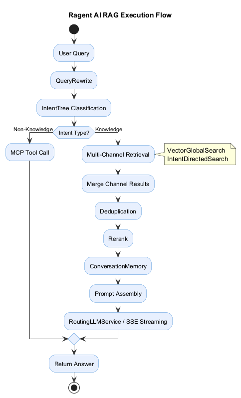
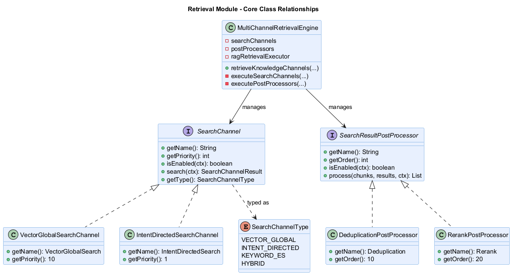

# 代码分析报告

## 1. 项目概述

Ragent AI 是一个企业级 Agentic RAG（检索增强生成）平台，基于 Spring Boot 3.5 + React 18 构建，覆盖从文档入库到智能问答的完整链路。本项目 fork 自 [nageoffer/ragent](https://github.com/nageoffer/ragent)，在此基础上进行功能增强。

### 1.1 技术栈

| 层次 | 技术 |
| --- | --- |
| 后端框架 | Java 17, Spring Boot 3.5.7 |
| 数据库 | PostgreSQL + pgvector（向量存储）+ zhparser（中文分词） |
| 缓存/消息 | Redis, RocketMQ |
| 可选组件 | Milvus（向量数据库） |
| 前端 | TypeScript, React 18, Vite, shadcn/ui |
| 鉴权 | Sa-Token |

### 1.2 模块结构

项目按 Maven 多模块组织，分为 5 个子模块：

```
ragent/
├── bootstrap/    核心业务：RAG 链路、知识库、入库 Pipeline、管理后台
├── framework/    共享基础设施：Web 层、异常体系、幂等、分布式ID、缓存、链路追踪
├── infra-ai/     模型供应商抽象层：Chat、Embedding、Rerank、HTTP 客户端
├── mcp-server/   独立 MCP 工具服务进程
└── resources/    数据库脚本、格式化模板
```

模块间依赖关系：`bootstrap` → `infra-ai` → `framework`，`mcp-server` 为独立进程。

## 2. 软件架构分析

### 2.1 分层架构

bootstrap 模块内部按职责进一步分层，包结构为 `com.nageoffer.ai.ragent.<领域>.<分层>`：

| 包 | 职责 | 核心类示例 |
| --- | --- | --- |
| `rag.core.retrieve` | 多路检索引擎及通道管理 | `MultiChannelRetrievalEngine` |
| `rag.core.retrieve.channel` | 检索通道接口及实现 | `SearchChannel`, `VectorGlobalSearchChannel` |
| `rag.core.retrieve.postprocessor` | 检索后处理器链 | `DeduplicationPostProcessor`, `RerankPostProcessor` |
| `rag.core.intent` | 意图识别 | `IntentTreeService`, `IntentNode` |
| `rag.core.rewrite` | 问题重写 | `QueryRewriteService` |
| `rag.core.memory` | 会话记忆 | `ConversationMemory` |
| `rag.core.mcp` | MCP 工具调用 | `McpToolExecutor` |
| `ingestion.engine` | 入库编排引擎 | `IngestionEngine` |
| `ingestion.node` | 入库 Pipeline 节点 | `ChunkerNode`, `IndexerNode` |
| `knowledge` | 知识库管理 | `KnowledgeBaseService` |
| `admin` | 管理后台接口 | `DashboardService` |

### 2.2 一次问答的完整执行流程



核心入口 `RetrievalEngine.retrieveKnowledgeChannels()` 调用 `MultiChannelRetrievalEngine`，将检索结果返回给上层进行后续的记忆注入和 Prompt 组装。

## 3. 检索模块详细分析

检索模块是整个 RAG 链路的核心，采用"**通道并行执行 + 后处理器链串行加工**"的两阶段架构。

### 3.1 核心类关系



**SearchChannel 接口**（4个方法 + 类型标识）：

- `getName()` — 通道名称，用于日志与监控
- `getPriority()` — 通道优先级，数字越小越优先执行
- `isEnabled(SearchContext)` — 运行时开关，根据上下文和配置决定是否启用
- `search(SearchContext)` — 执行检索，返回 `SearchChannelResult`
- `getType()` — 通道类型枚举值

**SearchResultPostProcessor 接口**（4个方法）：

- `getName()` — 处理器名称
- `getOrder()` — 执行顺序，数字越小越先执行
- `isEnabled(SearchContext)` — 运行时开关
- `process(chunks, results, context)` — 对 Chunk 列表进行加工，返回加工后的列表

两个接口均支持运行时开关（`isEnabled`），且都通过 Spring 的 `List<SearchChannel>` / `List<SearchResultPostProcessor>` 自动收集所有实现类，新增组件无需修改引擎代码。

### 3.2 MultiChannelRetrievalEngine 的两阶段执行

```java
// MultiChannelRetrievalEngine.java:64-77
public List<RetrievedChunk> retrieveKnowledgeChannels(...) {
    SearchContext context = buildSearchContext(subIntents, topK);

    // 阶段1：过滤已启用的通道 → 按优先级排序 → 并行执行
    List<SearchChannelResult> channelResults = executeSearchChannels(context);

    // 阶段2：合并所有通道结果 → 过滤已启用的处理器 → 按order排序 → 串行执行
    return executePostProcessors(channelResults, context);
}
```

阶段1的并行执行使用 `CompletableFuture.supplyAsync` + 专用线程池 `ragRetrievalExecutor`，每个通道独立执行，单个通道异常不影响其他通道：

```java
// MultiChannelRetrievalEngine.java:96-109
List<CompletableFuture<SearchChannelResult>> futures = enabledChannels.stream()
    .map(channel -> CompletableFuture.supplyAsync(
        () -> {
            try {
                return channel.search(context);
            } catch (Exception e) {
                log.error("检索通道 {} 执行失败", channel.getName(), e);
                return emptyResult(channel);
            }
        },
        ragRetrievalExecutor
    )).toList();
```

阶段2的后处理器链是责任链模式的变体——每个处理器接收上一个处理器的输出作为输入，形成链式加工流水线：

```java
// MultiChannelRetrievalEngine.java:174-189
for (SearchResultPostProcessor processor : enabledProcessors) {
    try {
        chunks = processor.process(chunks, results, context);
    } catch (Exception e) {
        log.error("后置处理器 {} 执行失败，跳过该处理器", processor.getName(), e);
        // 继续执行下一个处理器，不中断整个链
    }
}
```

### 3.3 原始检索通道实现

**原始架构中只有两个检索通道，且均为向量检索**：

**VectorGlobalSearchChannel**（优先级10，较低）

- 功能：在所有知识库的 collection 中执行向量检索
- 启用条件（复杂的兜底逻辑）：
  1. 配置中未启用 → 不执行
  2. 意图定向检索已关闭 → 必执行（兜底）
  3. 意图识别为空或无高置信度意图 → 执行（兜底）
  4. 单一中等置信度意图 → 执行（补充检索）
  5. 存在高置信度意图 → 不执行（由意图定向通道负责）
- 检索方式：调用 `RetrieverService` 进行向量相似度搜索（pgvector Cosine 距离）

**IntentDirectedSearchChannel**（优先级1，最高）

- 功能：基于意图识别结果，在特定意图对应的知识库中定向检索
- 启用条件：存在 KB 类型的意图（置信度超过配置阈值）
- 检索方式：同样是调用 `RetrieverService` 进行向量检索，但检索范围限定为意图对应的 collection

### 3.4 架构中的预留扩展点

`SearchChannelType` 枚举已经预定义了 4 种通道类型，但原始代码仅实现了前 2 种：

```java
public enum SearchChannelType {
    VECTOR_GLOBAL,      // 已实现：VectorGlobalSearchChannel
    INTENT_DIRECTED,    // 已实现：IntentDirectedSearchChannel
    KEYWORD_ES,         // 未实现：仅为枚举值，无对应实现类
    HYBRID              // 未实现：仅为枚举值，无对应实现类
}
```

`SearchChannel` 接口的注释也明确提到"ES 关键词检索"作为第三路通道的计划：

> 每个通道负责一种检索策略，例如：
> - 向量全局检索
> - 意图定向检索
> - ES 关键词检索

这说明原项目作者已经预见到向量检索的局限性，在架构层面预留了关键词检索的扩展点，但尚未实现。

## 4. 原始检索方案的不足

### 4.1 检索通道本质上同质化

两个已实现的通道——`VectorGlobalSearchChannel` 和 `IntentDirectedSearchChannel`——底层都依赖 `RetrieverService` 的向量相似度检索。它们的区别仅在于检索范围（全量 collection vs. 意图对应的 collection），并不构成检索策略的真正多样化。

这意味着当向量检索本身失效时（语义匹配失败），两个通道都不会返回有用结果。举例：

- 用户查询"AK-47"——向量模型可能将其与"步枪""武器"等语义关联，但文档中精确包含"AK-47"这个字符串的条目可能排名很低
- 用户查询"OrderService.createOrder"——这是一个方法名，向量模型无法理解其语义，检索效果差

### 4.2 缺乏精确关键词匹配能力

向量检索的本质是语义相似度计算。对于以下查询类型，语义匹配天然不如关键词精确匹配：

| 查询类型 | 示例 | 向量检索的问题 |
| --- | --- | --- |
| 专有名词 | 产品型号 "ThinkPad X1" | 向量模型可能未在训练数据中见过此型号 |
| 代码标识符 | 方法名 "getUserById" | 驼峰命名在向量空间中缺乏语义表征 |
| 配置项 | 参数名 "rag.rerank.enabled" | 点分隔的配置路径被当作无意义字符串 |
| 错误码 | "ERR_TIMEOUT_1001" | 错误码在训练语料中出现频率极低 |
| 短查询 | "限流"（仅2字） | 短文本向量缺乏足够的语义信息密度 |

### 4.3 中文分词能力缺失

原始检索流程中，文本在进入向量模型前经过 Embedding 服务编码为向量，但向量模型本身对中文的处理是黑盒的。在数据库层面，虽然 PostgreSQL 有全文检索能力，但原始架构并未利用。这意味着：

- 中文查询的分词质量完全依赖向量模型内部的分词器，不可控
- 无法利用 PostgreSQL 的 GIN 索引加速关键词查找
- 无法在数据库层面进行 ts_rank 相关性排序

### 4.4 后处理器链缺乏通道融合

原始架构的后处理器链包含两个处理器：

```
DeduplicationPostProcessor → RerankPostProcessor
```

- `DeduplicationPostProcessor`：基于文本内容去重（Hash 去重）
- `RerankPostProcessor`：调用 Rerank 模型对结果重新排序

两者均针对单一来源（向量检索）的结果进行后处理。当引入多路异构检索后，**缺少一个在去重之前将多路结果进行融合的处理器**。异构通道（向量+关键词）的分数不在同一尺度上，不能简单按分数合并排序。

### 4.5 不足总结

| 维度 | 现状 | 不足 |
| --- | --- | --- |
| 检索策略多样性 | 仅向量检索（2个通道本质相同） | 无法处理语义向量难以表征的查询 |
| 关键词匹配 | 无 | 专有名词、代码标识符、配置项等无法精确匹配 |
| 中文分词 | 依赖向量模型内部黑盒 | 不可控，无法针对业务场景优化 |
| 异构融合 | 无 | 如果引入新通道，缺少融合策略 |
| 扩展点利用 | `KEYWORD_ES`、`HYBRID` 枚举值闲置 | 架构已预留但未实现 |

## 5. 改进方向

基于以上不足分析，需要在现有的多路检索架构基础上增加**关键词全文检索通道**，填补精确关键词匹配的空白。

### 5.1 设计原则

改进遵循原架构的设计理念，不破坏现有扩展机制：

1. **实现 SearchChannel 接口**：将关键词检索作为一个新的 `SearchChannel` 实现，复用现有的并行执行和异常容错机制
2. **新增融合后处理器**：在去重之前插入 `HybridFusionPostProcessor`，将向量与关键词两路结果按统一策略融合
3. **实现 FusionStrategy**：提供 RRF 和加权求和两种融合算法，支持运行时切换
4. **利用 PostgreSQL 全文检索**：配合 zhparser 中文分词扩展，在不引入新基础设施的前提下实现中文关键词检索
5. **填充预留枚举**：使 `SearchChannelType.KEYWORD_ES` 对应到具体实现类

### 5.2 预期改进效果

| 维度 | 改进前 | 改进后 |
| --- | --- | --- |
| 检索通道数 | 2路（均为向量检索） | 3路（向量 + 意图定向 + 关键词） |
| 检索策略 | 仅语义匹配 | 语义匹配 + 精确关键词匹配互补 |
| 融合能力 | 无 | RRF / 加权求和，通道结果统一排序 |
| 中文分词 | 不可控（向量模型内部） | zhparser 词语级可控分词 |
| 零召回率 | 依赖向量模型覆盖度 | 关键词 OR 语义兜底，大幅降低零召回 |
