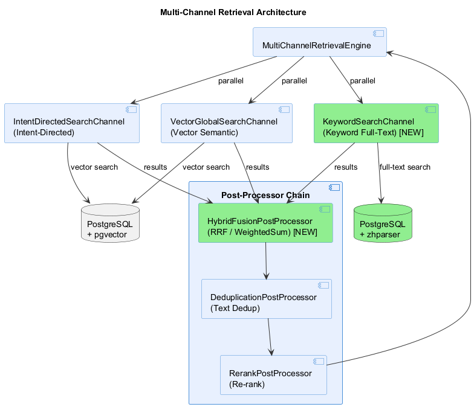

# 优化报告：关键词检索通道

## 1. 优化背景

### 1.1 原始架构的局限

Ragent AI 的多路检索引擎（`MultiChannelRetrievalEngine`）最初仅包含两个检索通道：

- **VectorGlobalSearchChannel**：基于 pgvector 向量相似度的语义检索
- **IntentDirectedSearchChannel**：基于意图分类的定向检索

两者本质上都是向量检索。向量检索擅长捕捉语义相近的内容，但对以下场景存在明显短板：

- **专有名词**：产品型号（如"ThinkPad X1 Carbon"）、API 名称（如"getUserById"）
- **精确关键词**：配置项名称、错误码、特定术语
- **低语义密度短查询**：用户输入仅两三个字的场景

在这些场景下，仅靠向量相似度难以保证召回率和精准度。

### 1.2 优化目标

引入关键词全文检索作为独立的第三路检索通道，与向量检索互补，通过混合融合策略提升整体召回与排序质量。具体目标：

1. 利用 PostgreSQL 全文检索能力，实现关键词级别的精确匹配
2. 支持中文分词，而非按字切分
3. 通过融合策略（RRF/加权求和）合并向量与关键词两路结果
4. 保证检索的稳定性和零召回率的降低

## 2. 实现思路

### 2.1 整体架构

关键词检索通道作为 `SearchChannel` 接口的实现，嵌入现有的多路检索体系：



### 2.2 核心组件设计

**KeywordSearchChannel**：通过 PostgreSQL `tsvector`/`tsquery` 机制，利用预先构建的全文索引（GIN 索引）进行关键词检索。支持跨多个知识库 collection 并行检索，单个 collection 失败不影响整体。

**HybridFusionPostProcessor**：在去重之后、Rerank 之前执行，将关键词通道结果与向量通道结果按指定融合策略合并。

**FusionStrategy**：策略接口，提供两种实现：

| 策略 | 算法 | 特点 |
| --- | --- | --- |
| RRF | `score(d) = Σ 1/(k + rank_i(d))` | 不依赖分数归一化，仅依赖排名，跨通道可比 |
| 加权求和 | `score(d) = Σ w_i × normalized_score_i(d)` | 通道权重可调，适合已知各通道置信度的场景 |

## 3. 迭代优化过程

整个关键词检索通道的实现并非一步到位，而是经历了四个阶段的渐进迭代，每次迭代解决前一步暴露的问题。

### 3.1 阶段一：基础通道搭建（提交 5c81d40）

**做了什么**

首次引入 `KeywordSearchChannel`，核心检索逻辑基于 PostgreSQL 全文检索：

```sql
SELECT id, content, ts_rank(tsv, plainto_tsquery('simple', ?)) AS score
FROM t_knowledge_vector
WHERE tsv @@ plainto_tsquery('simple', ?)
ORDER BY score DESC
```

- 使用 `plainto_tsquery` 函数将用户查询转为 tsquery
- 使用 `simple` 配置，即按字切分（不进行语言级分词）
- 同时引入 `RRFFusionStrategy`、`WeightedSumFusionStrategy`、`HybridFusionPostProcessor`
- 前端新增系统设置页面，支持检索参数动态配置

**存在的问题**

`simple` 分词器对中文按单字切分，"全文检索"会切为"全"、"文"、"检"、"索"四个单字，丢失了词语级别的语义。检索结果噪声大，排序质量差。

### 3.2 阶段二：切换中文分词引擎（提交 cf10558）

**问题分析**

`simple` 配置是 PostgreSQL 默认的最小化分词器，对英文按空格分词，对中文只能按字符逐个切分。中文检索需要词语级别的分词能力。

**解决方案**

将全文检索配置从 `simple` 切换为 `zhparser`——一个基于 Simple Chinese Word Segmentation（SCWS）的 PostgreSQL 中文分词扩展：

```diff
- plainto_tsquery('simple', ?)
+ plainto_tsquery('zhparser', ?)
```

同时在数据库层面：

- 安装 `zhparser` 扩展
- 创建使用 zhparser 的文本检索配置
- 更新触发器，使新增/更新数据使用新配置构建 tsvector
- 提供升级脚本，回填存量数据的 tsvector

**效果**

查询如"全文检索"可正确切分为"全文"+"检索"两个词进行匹配，中文召回精度显著提升。

**新问题**

测试发现部分中文查询仍然返回 0 条结果。经排查，`plainto_tsquery` 将分词结果用 `&`（AND）连接。例如"模型路由配置"被转为 `模型 & 路由 & 配置`，要求所有分词同时命中。对于知识库中仅包含部分关键词的文档，这种 AND 语义过于严格。

### 3.3 阶段三：AND 语义改为 OR 语义（提交 0fc87b8）

**问题分析**

`plainto_tsquery` 函数的设计目的是"将纯文本转换为 tsquery"，其内部逻辑是：
1. 用分词器将文本切分为 token
2. 将所有 token 用 `&` 连接

这意味着用户输入的关键词越多，匹配条件越严格——反而增加了零召回的概率。对于一个关键词检索通道，OR 语义（匹配任一词即可）更合理。

**解决方案**

放弃 `plainto_tsquery`，改用 `to_tsquery` 并手动构建 OR 语义的查询表达式：

```java
// 将空格替换为 | 实现 OR 语义：匹配任一词即可命中
String tsQuery = sanitized.trim().replaceAll("\\s+", " | ");
```

改动前：
```
查询: "Redis 缓存 穿透"
tsquery: 'redis' & '缓存' & '穿透'    -- 三个词必须同时命中
```

改动后：
```
查询: "Redis 缓存 穿透"
tsquery: 'redis' | '缓存' | '穿透'    -- 命中任一词即可
```

**效果**

零召回问题大幅改善。即使用户输入多个关键词，只要任一词在文档中出现即可召回。

**新问题**

仍存在部分查询 `to_tsquery` 返回空的情况。定位到两种原因：

1. **zhparser 未配置 token 类型映射**：zhparser 分词后会给每个 token 标注词性（n=名词, v=动词, a=形容词等），PostgreSQL 需要显式 `ADD MAPPING` 告知哪些词性可用于全文检索。缺少映射时所有 token 被丢弃，`to_tsvector` 返回空。

2. **中英文混合文本**：查询如 `Redis介绍` 包含英文和中文相邻，zhparser 将其视为一个整体 token，无法在词典中匹配，导致 `to_tsquery` 返回空。

### 3.4 阶段四：修复分词失败根因（提交 9381c4d）

**问题分析**

针对上述两个根因逐一处理：

- **Token 类型映射缺失**：zhparser 默认不映射任何 token 类型到全文检索词典，需在创建检索配置时显式声明。
- **中英文边界**：`"Redis介绍"` 被当成单个 token，zhparser 无法解析。需在送入 `to_tsquery` 之前在英文与中文之间插入空格。

**解决方案**

数据库层面（`schema_pg.sql` / `upgrade_v1.2_to_v1.3.sql`）：

```sql
-- 为 zhparser 配置 token 类型映射
ALTER TEXT SEARCH CONFIGURATION zhparser
  ADD MAPPING FOR n,v,a,i,e,l WITH simple;
-- n=名词, v=动词, a=形容词, i=习语, e=英文, l=其他
-- 未映射的词性类型不会被索引，导致 tsvector 为空
```

应用代码层面（`KeywordSearchChannel.java`）：

```java
// 预处理查询：移除特殊字符
String sanitized = query.replaceAll("[^\\w\\u4e00-\\u9fff\\s]", " ");
// 在中英文/数字交界处插入空格，避免混合文本被当成单个 token
sanitized = sanitized.replaceAll(
    "(?<=[\\u4e00-\\u9fff])(?=[a-zA-Z0-9])|(?<=[a-zA-Z0-9])(?=[\\u4e00-\\u9fff])", " ");
// 将空格替换为 | 实现 OR 语义
String tsQuery = sanitized.trim().replaceAll("\\s+", " | ");
```

**正则说明**

```
(?<=[\\u4e00-\\u9fff])(?=[a-zA-Z0-9])  → 中文字符后紧跟英文字母/数字
(?<=[a-zA-Z0-9])(?=[\\u4e00-\\u9fff])  → 英文字母/数字后紧跟中文字符
```

两段均为零宽断言（lookahead/lookbehind），只匹配位置不消耗字符，在边界处插入空格。

**效果**

- `"Redis介绍"` 预处理后变为 `"Redis 介绍"`，两个 token 分别处理，不会再产生空 tsquery
- Token 类型映射后，zhparser 分词结果正确写入 tsvector，存量数据也能被检索到
- 清理了前期调试用的诊断日志和验证查询

## 4. 关键技术决策

### 4.1 为什么不用 Elasticsearch

项目中已存在 Milvus 作为可选的向量数据库。增加 Elasticsearch 会引入新的基础设施依赖。PostgreSQL 自带的全文检索配合 zhparser 能满足中小规模的中文检索需求，且与现有 pgvector 共享同一数据库实例，运维成本最低。

### 4.2 为什么选择 RRF 融合而非分数归一化

向量检索的 Cosine 距离和全文检索的 ts_rank 分数处于不同的数值空间，不具备直接可比性。RRF（Reciprocal Rank Fusion）仅依赖各通道内的排名而非原始分数，天然绕过了归一化问题，且算法简单、无超参（仅一个常数 k=60），在 TREC 等信息检索评测中已被验证有效。

### 4.3 OR 语义的取舍

改用 OR 语义会降低检索精度（噪声增多），但 RRF 融合和后续的 Rerank 重排序环节可以弥补。相比之下，AND 语义导致的零召回对用户体验的损害更大。一个可选的后续优化是引入 `ts_rank_cd`（覆盖率密度排名）提升 OR 语义下的排序质量。

## 5. 整体效果评估

| 维度 | 优化前 | 优化后 |
| --- | --- | --- |
| 中文分词能力 | 按字切分（simple），词语级语义丢失 | zhparser 词语级分词，召回精度提升 |
| 零召回率 | AND 语义严格，多关键词查询频繁零召回 | OR 语义 + 边界处理，零召回大幅改善 |
| 专有名词检索 | 仅依赖向量相似度，精确匹配效果差 | 关键词通道补充精确匹配，互补效果好 |
| 检索通道数 | 2路（均为向量检索变体） | 3路（向量+意图导向+关键词） |
| 融合策略 | 无（仅去重） | 支持 RRF / 加权求和，可动态配置 |
| 可观测性 | 无区分 | 每通道独立 success/failure/latency 统计日志 |

## 6. 联网检索增强（Tavily 集成）

### 6.1 优化背景

在关键词检索通道完善之后，系统仍面临一个边界场景：当用户问题超出知识库覆盖范围时，即使混合检索也无法返回有效内容。原始系统仅返回"未检索到相关内容"，用户体验断崖式下跌。

典型场景：
- 用户询问知识库中不存在的技术（如"YOLO目标检测算法"）
- 用户询问通用知识（如"Redis 是什么"）
- 新建知识库初期文档不足，大量查询落空

为此，引入联网搜索作为兜底增强机制——当知识库检索不理想时，自动从互联网获取信息补充回答。

### 6.2 架构设计

联网搜索通过 `WebSearchService` 接口抽象，实现 `DefaultWebSearchService`，支持双搜索引擎分级降级：

```
用户提问 → RAG检索 → 意图置信度不足 / KB为空
                      ↓
              WebSearchService.search()
                      ↓
          ┌─ Tavily Search API（主）
          │   apiKey已配置 → 返回AI总结+结构化结果
          │   apiKey未配置 → 降级
          └─ DuckDuckGo API（兜底）
              → 返回即时答案+相关主题
```

集成点位于 `StreamChatPipeline`，在检索上下文为空或意图置信度低时触发：

```java
// StreamChatPipeline.shouldAugmentWithWebSearch()
if (!webSearchProperties.isEnabled()) return false;
if (!hasLowConfidenceIntents(ctx)) return false;
log.info("意图置信度不足，启用联网搜索增强");
return handleAugmentedSearch(ctx, retrievalCtx);
```

### 6.3 双搜索引擎策略

| 引擎 | 类型 | 需要 API Key | 特点 |
|------|------|-------------|------|
| Tavily | AI 优化搜索 API | 是 | 返回 AI 总结回答 + 结构化搜索结果，质量高，速度快 |
| DuckDuckGo | 免费即时答案 API | 否 | 无需注册，作为免费兜底，结果较简单 |

**分级降级链路**：

```
Tavily (已配置Key) → Tavily 调用失败/超时 → DuckDuckGo 降级 → 联网搜索无结果 → 回退正常RAG
```

**Tavily 请求格式**（JSON POST）：

```java
JSONObject body = JSONUtil.createObj();
body.set("api_key", apiKey);
body.set("query", query);
body.set("search_depth", "basic");
body.set("max_results", Math.min(maxResults, 10));
body.set("include_answer", true);
```

Tavily 的 `include_answer=true` 参数使其返回一段 AI 总结性回答，系统将其作为首个结果返回（标记为"AI 总结"），后续跟随详细的搜索结果条目。

### 6.4 配置与运维

`WebSearchProperties` 通过 Spring Boot 配置前缀 `rag.websearch` 管理：

| 配置项 | 默认值 | 说明 |
|--------|--------|------|
| `rag.websearch.enabled` | false | 联网搜索总开关 |
| `rag.websearch.provider` | duckduckgo | 搜索引擎选择（tavily/duckduckgo） |
| `rag.websearch.api-key` | — | Tavily API Key（DuckDuckGo 不需要） |
| `rag.websearch.max-results` | 5 | 最大返回结果数 |

未配置 Tavily API Key 时自动降级到 DuckDuckGo，无需人工干预。

### 6.5 效果评估

基于实际测试（详见 `docs_my/联网检索_测试报告.md`）：

| 测试问题 | 知识库覆盖 | 联网搜索结果 | 效果 |
|----------|-----------|-------------|------|
| "Redis介绍" | 无 | Tavily 返回 Redis 定义、数据类型、特性等 | 完整回答了用户问题 |
| "介绍YOLO" | 无 | Tavily 返回 YOLO 算法原理、版本演进、优劣势 | 提供专业级回答，标注来源 |
| "PyTorch搭建CNN步骤" | 有（kbpytorch） | 未触发联网搜索 | 正常 RAG 链路完成 |

**关键特性**：
- 联网搜索结果会标注来源 URL，提供信息溯源能力
- 回答末尾自动添加"以上部分信息来源于联网搜索，仅供参考"提示
- 支持流式输出（SSE），与 RAG 回答体验一致

## 7. RAG 效果评测系统

### 7.1 优化背景

检索增强生成（RAG）系统的质量评估面临天然挑战：检索质量≠答案质量，答案质量受检索、生成、幻觉等多重因素影响。缺乏系统化的评测机制，优化工作陷入"凭感觉调参"的困境。

为此，建立基于"LLM-as-Judge"范式的自动化评测体系——用 LLM 以标准化标准评审 RAG 输出的每个维度，实现可量化、可追溯、可对比的质量监控。

### 7.2 评测指标体系

系统定义三维度评测指标，覆盖 RAG 答案质量的核心关切：

| 指标 | 英文名 | 评测内容 | 依赖项 | Prompt 模板 |
|------|--------|---------|--------|------------|
| 忠实度 | Faithfulness | 答案中每个关键结论是否都能从检索上下文找到依据 | 问题 + 答案 + 检索上下文 | `eval-faithfulness.st` |
| 答案相关性 | Answer Relevancy | 答案是否直接回应了用户问题，有无偏离 | 问题 + 答案 | `eval-answer-relevancy.st` |
| 正确性 | Correctness | 答案的事实是否正确（结合知识库上下文和通用知识） | 问题 + 答案 + 检索上下文 | `eval-correctness.st` |

**评分规则**（0-1 连续量表）：

```
PASS (score ≥ 0.7): 答案质量合格
WARN (0.4 ≤ score < 0.7): 答案存在质量问题，需关注
FAIL (score < 0.4): 答案不合格，可能含幻觉或无关内容
```

### 7.3 架构设计

评测系统采用"异步事件驱动 + 策略模式 + RocketMQ 消息队列"的三层架构：

```
SSE Answer Stream Complete
        │
        ▼
StreamChatEventHandler  ──→  投递 RagEvalEvent  ──→  RocketMQ Topic
                                                          │
                                                          ▼
                                                  RagEvalConsumer
                                                          │
                                                          ▼
                                              RagEvaluationServiceImpl
                                                          │
                              ┌───────────────────────────┼───────────────────────────┐
                              ▼                           ▼                           ▼
                      FaithfulnessEvaluator    AnswerRelevancyEvaluator    CorrectnessEvaluator
                              │                           │                           │
                              └───────────────────────────┼───────────────────────────┘
                                                          ▼
                                                  RagJudgeClient (LLM调用)
                                                          │
                                                          ▼
                                                  结果写入 t_rag_eval_result
                                                          │
                                                          ▼
                                               Admin 评测看板 (EvalStatsService)
```

**核心组件**：

| 组件 | 职责 | 设计模式 |
|------|------|---------|
| `RagEvaluationService` | 评测入口，遍历所有启用的评测器 | 门面模式 |
| `RagMetricEvaluator` | 单一评测指标的执行逻辑（@FunctionalInterface） | 策略模式 |
| `RagJudgeClient` | 封装 LLM Judge 调用：渲染 Prompt 模板 → 调用模型 → 解析 JSON 响应 | 模板方法 |
| `EvalPendingStore` | ConcurrentHashMap 暂存对话上下文，等待 SSE 流完成后触发评测 | 暂存模式 |
| `RagEvalConsumer` | RocketMQ 消费者，异步消费评测事件 | 事件驱动 |
| `EvalStatsService` | 管理后台评测看板数据服务：总览/趋势/低分样本 | 查询服务 |

### 7.4 评测 Prompt 模板设计

评测质量依赖于 Judge Prompt 的精确设计。以忠实度（Faithfulness）评测模板为例：

```
你是一个严格的RAG答案忠实度评审专家。
## 评审标准
- score = 1.0：答案中所有关键事实/数据/结论都能在上下文中找到明确出处
- score = 0.7~0.9：有少量次要细节无依据，但主要结论均有支持
- score = 0.4~0.6：部分关键结论无依据
- score = 0.1~0.3：多数结论无依据
- score = 0.0：答案完全捏造

## 输出格式
{"score": <0到1>, "label": "<PASS|WARN|FAIL>",
 "reason": "判断依据", "unsupported_claims": [...], "supported_claims": [...]}
```

模板位于 `bootstrap/src/main/resources/prompt/`，使用 StringTemplate（.st）格式，通过 `{​{slots}}` 占位符注入运行时数据。这种设计将评测逻辑与 Prompt 分开，允许在不修改代码的情况下调整评测标准。

### 7.5 评测流程与采样

**端到端流程**：

1. **问题到达** → `EvalPendingStore.put(taskId, PendingData)` 暂存问题和上下文
2. **RAG 完成** → `StreamChatEventHandler` 组装 `RagEvalEvent`（含 traceId、question、answer、kbContext、mcpContext），发送到 RocketMQ
3. **异步消费** → `RagEvalConsumer` 接收事件，调用 `RagEvaluationServiceImpl.evaluate()`
4. **评测执行** → 根据 `RagEvalProperties.metrics` 配置，依次执行已启用的评测器
5. **LLM 评审** → `RagJudgeClient` 渲染模板、调用模型（默认 qwen-plus，temperature=0.0，thinking=false），解析 JSON 结果
6. **结果落库** → 写入 `t_rag_eval_result` 表，同时更新 `t_rag_trace_run` 的 extraData 字段
7. **看板消费** → `EvalStatsService` 提供总览/趋势/低分样本查询

**采样机制**：

`RagEvalProperties.sampleRate` 控制评测采样率（默认 5%），避免全量评测对 API 成本和延迟的压力。采样决策在 `StreamChatEventHandler` 中执行，通过随机数判断是否投递评测事件。

### 7.6 管理后台评测看板

`EvalStatsController` + `EvalStatsServiceImpl` 提供三个看板接口：

| API | 参数 | 功能 |
|-----|------|------|
| `loadOverview` | window (24h/7d/30d/90d) | 总览：三维度平均分、低分数量、低分占比 |
| `loadTrends` | metric + window + granularity | 趋势图：按小时/按天的分数变化趋势 |
| `loadLowScoreSamples` | metric + limit | 低分样本：FAIL 标签的结果列表，支持 badcase 分析 |

**看板数据模型**：

```
EvalOverviewVO {
    avgFaithfulness, avgAnswerRelevancy, avgCorrectness,
    lowScoreCount, totalEvalCount, lowScoreRatio
}

EvalTrendPointVO {
    time, avgScore, totalCount, failCount
}

LowScoreSampleVO {
    id, traceId, question, answer, metricName, score, label, reason, createTime
}
```

这些接口为持续优化提供了数据驱动决策的基础——通过趋势图观察检索质量的变化，通过低分样本定位 Badcase 的共性模式，形成"评测→分析→改进→再评测"的持续改进闭环。

## 8. 总结

关键词检索通道的优化经历了一条典型的"实现-发现问题-修复-再发现问题-再修复"迭代路径：

```
基础搭建(simple分词) → 中文分词(zhparser) → AND→OR语义 → 分词失败修复
    阶段一              阶段二             阶段三         阶段四
```

联网搜索（Tavily + DuckDuckGo）为知识库覆盖不足的场景提供兜底增强，RAG 效果评测系统（LLM-as-Judge + 三维度指标 + 异步事件驱动）建立了可量化的质量保障体系。三者共同构成了从"检索能力增强"到"外部知识补充"再到"质量持续监控"的完整优化闭环。

累计修改涉及：关键词检索通道 3 个核心文件（`KeywordSearchChannel.java`、`schema_pg.sql`、`upgrade_v1.2_to_v1.3.sql`），联网搜索 4 个文件（`WebSearchService.java`、`DefaultWebSearchService.java`、`WebSearchProperties.java`、`StreamChatPipeline.java`），评测系统 12+ 个文件（服务层、评测器、Judge 客户端、Prompt 模板、消息队列、管理后台看板）。这是软件工程中"小步快跑、持续改进"理念在 RAG 系统优化上的具体实践。
