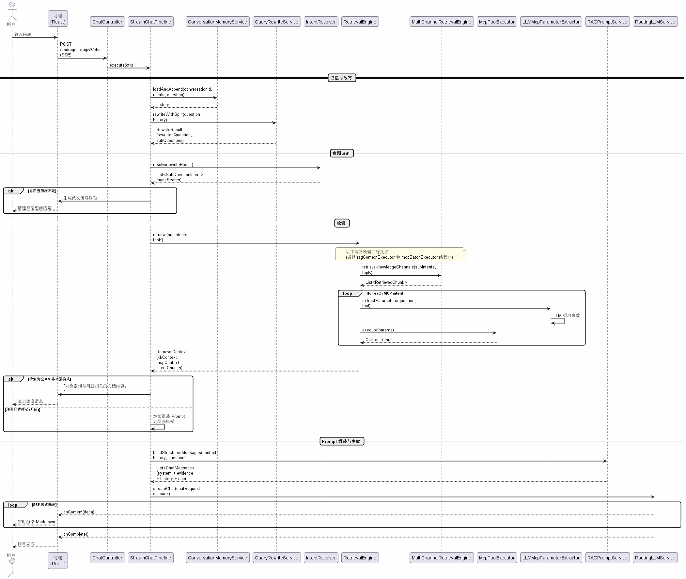
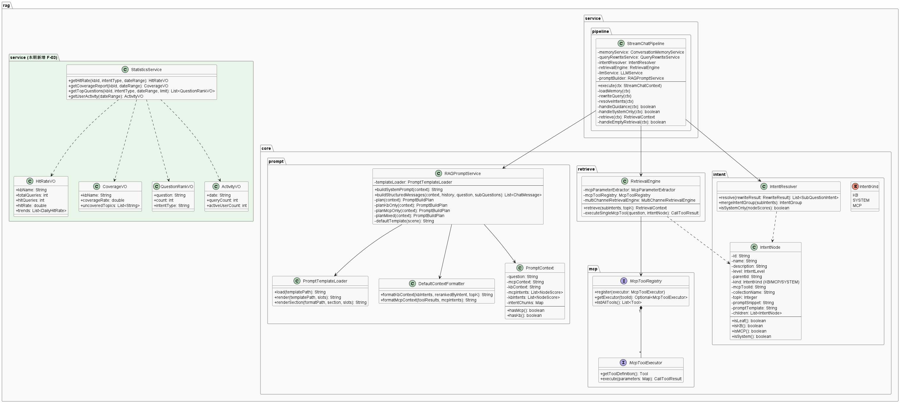
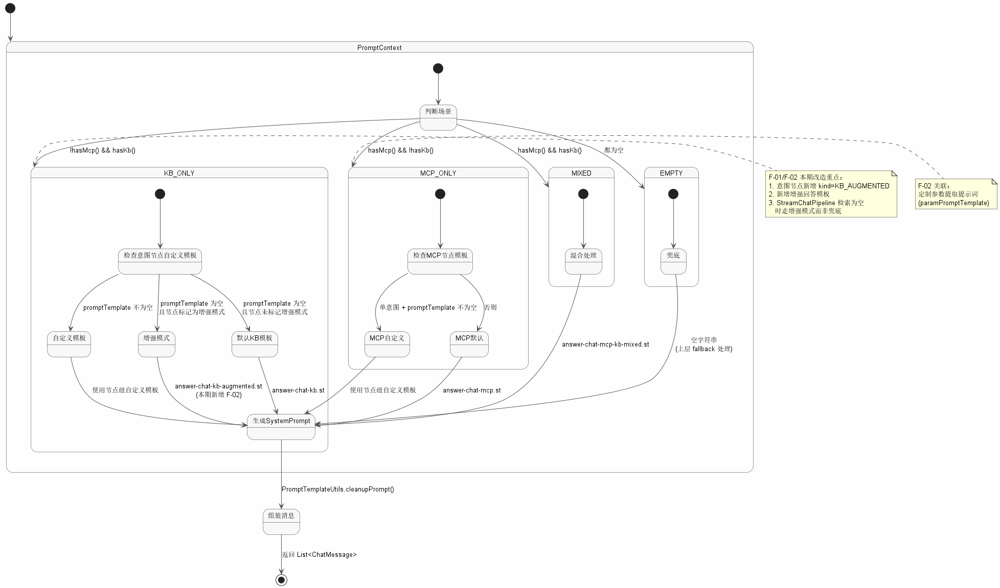

**文档编号：ragent – SRS – v1.0**

**企业智能知识管理与问答平台**

**软件需求规格说明书**

**日期：2026-05-23**

**文档变更历史记录**

| 序号 | 变更日期 | 变更人员 | 变更内容详情描述 | 变更后的版本号 |
| --- | --- | --- | --- | --- |
| 1 | 2026-05-23 |  | 初始版本，基于开源项目 Ragent AI 分析编写 | v1.0 |

---

## 1. 引言

### 1.1 编写目的

本文档旨在明确"企业智能知识管理与问答平台"的功能需求与非功能需求，为后续的系统设计、编码实现和测试验收提供依据。

本项目基于开源 RAG 平台 Ragent AI（GitHub: nageoffer/ragent）进行二次开发。本文档在描述开源项目已有功能的基础上，重点定义本期需要改造和新增的功能需求。

### 1.2 读者对象

本文档的读者对象包括：

- **项目开发团队**：理解需求，指导系统设计与编码实现
- **课程评审老师**：了解项目范围、功能边界和实现目标
- **测试人员**：根据需求规格编写测试用例

### 1.3 软件项目概述

- **项目名称**：企业智能知识管理与问答平台
- **简称/代号**：ragent
- **开发单位**：课程项目团队（4 人）
- **大致功能和用途**：一个面向企业的智能知识管理平台，支持员工以自然语言提问，系统基于内部知识库检索相关文档片段，交由大语言模型（LLM）生成可信回答。核心功能包括知识库管理、智能问答、会话管理、模型引擎路由、MCP 工具集成、管理后台及数据统计分析。

### 1.4 文档概述

本文档共分五章：

- **第 1 章**：引言，说明编写目的、读者对象、项目概况和术语定义
- **第 2 章**：软件的一般性描述，描述系统与外部环境的关系、限制与假设
- **第 3 章**：软件功能需求描述，使用用例模型和分析模型详细定义功能需求。本期聚焦三大改造/新增需求：意图树节点配置、Prompt 模板定制、数据统计与报表
- **第 4 章**：其它软件需求，包括性能、设计约束、界面、进度、交付和验收要求
- **第 5 章**：软件原型

### 1.5 定义

| 术语/缩写 | 定义 |
|:---|:---|
| RAG | Retrieval-Augmented Generation，检索增强生成。一种结合信息检索与 LLM 生成的技术架构 |
| LLM | Large Language Model，大语言模型 |
| MCP | Model Context Protocol，模型上下文协议。用于 LLM 与外部工具/数据源交互的标准协议 |
| 意图树 | 多级树形意图分类体系，将用户问题从通用分类逐步细化到具体知识领域 |
| Prompt 模板 | 用于指导 LLM 生成回答的系统提示词模板 |
| Embedding | 将文本转换为向量表示的技术，用于语义相似度计算 |
| ReRank | 对初步检索结果进行二次排序，提升相关性 |
| SSE | Server-Sent Events，服务端推送事件，用于流式输出回答 |
| 增强回答模式 | 知识库检索结果不足时，LLM 结合自身通用知识补充回答，并标注信息来源 |

### 1.6 参考资料

| 名称 | 来源 |
|:---|:---|
| Ragent AI 开源项目 | https://github.com/nageoffer/ragent |
| MCP 协议规范 | https://modelcontextprotocol.io |
| Spring Boot 3.5 官方文档 | https://docs.spring.io/spring-boot |
| 软件需求构思及描述 | docs_my/软件需求构思及描述.md |

---

## 2. 软件的一般性描述

### 2.1 软件产品与其环境之间的关系

本系统由以下组件协同构成运行环境：

| 组件 | 关系说明 |
|:---|:---|
| 前端应用（React 18） | 用户交互界面，通过 Nginx 托管，API 请求代理至后端 |
| 后端服务（Spring Boot 3.5） | 核心业务逻辑、RAG 编排、REST API，端口 9090 |
| PostgreSQL + pgvector | 业务数据存储 + 向量检索能力 |
| Redis | 会话缓存、分布式排队限流 |
| RocketMQ | 异步消息队列，处理索引任务和反馈事件 |
| LLM API | 兼容 OpenAI 协议的模型服务，提供 Embedding、Chat、ReRank |
| MCP Server | 独立的 MCP 工具服务进程（端口 9099），提供业务工具调用 |

**外部用户**：企业员工，通过浏览器访问前端页面进行知识问答。

**外部系统依赖**：LLM 模型 API 为外部依赖，需确保网络可达和 API Key 有效。

### 2.2 限制与约束

| 约束项 | 说明 |
|:---|:---|
| 运行环境 | JDK 17+，Node.js 18+，PostgreSQL 15+，Redis 7+ |
| 内存要求 | 开发环境最低 16GB RAM（后端 + DB + Redis + 前端） |
| LLM 依赖 | 需接入兼容 OpenAI 协议的模型 API，网络稳定、API Key 有效 |
| 开发周期 | 48 课时（任务一 8 + 任务二 14 + 任务三 8 + 任务四 18） |
| 团队规模 | 4 人 |
| 代码量要求 | 代码阅读 >10000 行，维护新增 >1000 行 |
| 技术栈约束 | Java 17 + Spring Boot 3.5 + React 18 + TypeScript，沿用 Ragent 原有技术栈 |

### 2.3 假设与前提条件

1. LLM API 服务稳定可用，支持 Embedding、Chat、ReRank 三类模型
2. 企业知识库文档已完成整理，以 PDF、Word、Markdown、TXT 格式提供
3. 用户具备基本的浏览器操作能力，无需培训即可使用问答功能
4. 开发团队成员具备 Java 后端开发基础，了解 Spring Boot 和 MyBatis Plus
5. 开源项目 Ragent AI 代码可正常运行，文档准确

---

## 3. 软件功能需求描述

### 3.1 软件功能概述

#### 3.1.1 开源项目已有功能（复用）

以下功能由 Ragent AI 开源项目提供，直接复用，不纳入本期开发范围：

| 功能模块 | 功能点 | 优先级 |
|:---|:---|:---|
| 知识库管理 | 知识库 CRUD、文档上传、智能分块、向量化入库、入库 Pipeline | 高 |
| 智能问答 | 自然语言提问、SSE 流式输出、问题重写、多路检索（向量全局+意图导向）、ReRank | 高 |
| 会话管理 | 多会话管理、历史会话检索、多轮对话上下文、记忆摘要压缩 | 高 |
| 模型引擎 | 多模型供应商配置、优先级调度、三态熔断器、自动降级 | 高 |
| MCP 工具集成 | MCP 工具注册与发现、LLM 参数提取、工具调用 | 中 |
| 管理后台 | 仪表板、知识库管理、意图树编辑、链路追踪、模型管理、用户管理 | 中 |
| 安全与可靠性 | Sa-Token 认证、分布式排队限流、AOP 链路追踪、三级异常体系 | 高 |

#### 3.1.2 本期改造与新增功能

本期聚焦 3 项功能，总分 3 个包/模块：

| 功能编号 | 功能名称 | 类型 | 优先级 | 预估代码量 |
|:---|:---|:---|:---|:---|
| F-01 | 意图树节点配置扩展 | 改造 | 高 | ~200 行 |
| F-02 | Prompt 模板定制 | 改造 | 高 | ~200 行 |
| F-03 | 数据统计与报表 | 新增 | 中 | ~350 行 |

**F-01 意图树节点配置扩展**

扩展意图树的节点类型和分类能力，满足企业多部门知识问答需求：

- 新增企业专属意图节点：HR 政策咨询、IT 技术支持、财务流程问询等
- 新增"增强回答"混合模式：当知识库检索不足时，LLM 结合自身通用知识补充回答，并标注信息来源（"根据知识库…此外，根据通用知识…"）
- 按意图节点调整检索参数：topK、相似度阈值、检索通道、温度
- 支持在管理后台可视化创建和编辑意图节点

输入：用户在管理后台意图树编辑页面配置节点；用户提问时，IntentResolver 按意图树进行分类
输出：IntentNode 配置持久化到数据库，问答时自动应用节点级参数

**F-02 Prompt 模板定制**

基于企业场景定制 LLM 的 System Prompt 和回答风格：

- 定制企业 System Prompt：加入企业语气风格、回答格式要求、合规约束（不暴露内部文档结构、不输出内网链接等）
- 新增增强回答模板 `answer-chat-kb-augmented.st`：
  - 信息源优先级：知识库文档 > LLM 通用知识
  - 知识库内容不需要标注来源，通用知识补充需用自然方式区分
  - 冲突时以知识库为准
- 改造 `StreamChatPipeline`：检索为空时不再直接返回兜底文案，走增强回答模式
- 定制 MCP 工具参数提取提示词，提升 LLM 从用户问题中提取工具参数的准确率

输入：用户提问或 MCP 工具调用请求
输出：组装好的 ChatMessage 列表，发送给 LLM

**F-03 数据统计与报表**

构建 RAG 质量仪表板，量化系统运行效果：

- 检索命中率统计：按知识库维度、按意图分类维度统计"检索到文档的问答数 / 总问答数"
- 问答覆盖率分析：识别知识盲区——统计用户提问中被标记为"未检索到"的高频问题，作为知识库补充依据
- 高频问题排行：统计各知识库、各意图分类下的 Top N 高频问题
- 用户活跃度趋势：按日/周维度统计问答量变化
- 前端新增统计页面（管理后台菜单下），后端新增统计查询 REST API

输入：存储在数据库中的问答记录、检索结果、反馈数据
输出：JSON 格式统计数据 + 前端图表可视化

### 3.2 软件需求的用例模型

#### 3.2.1 用例图参与者

| 参与者 | 说明 |
|:---|:---|
| 普通用户（员工） | 使用自然语言提问，获取基于知识库的回答 |
| 知识库管理员 | 管理知识库、上传文档、配置意图树、查看统计报表 |
| 系统管理员 | 配置模型参数、管理用户权限、查看系统运行状态 |

#### 3.2.2 用例列表

**普通用户用例：**

| 用例编号 | 用例名称 | 描述 | 优先级 |
|:---|:---|:---|:---|
| UC-01 | 智能问答 | 用户输入自然语言问题，系统流式输出回答 | 高 |
| UC-02 | 增强问答 | 知识库检索不足时，系统结合通用知识补充回答 | 中 |
| UC-03 | 管理会话 | 创建、切换、删除会话；查看历史问答记录 | 中 |
| UC-04 | 提交反馈 | 对回答点赞/点踩 | 低 |

**知识库管理员用例：**

| 用例编号 | 用例名称 | 描述 | 优先级 |
|:---|:---|:---|:---|
| UC-05 | 管理知识库 | 创建、编辑知识库，设置检索策略 | 高 |
| UC-06 | 上传文档 | 上传 PDF/Word/Markdown 文档，自动解析入库 | 高 |
| UC-07 | 配置意图树 | 创建和编辑意图节点，绑定知识库/MCP 工具 | 高 |
| UC-08 | 配置 Prompt 模板 | 为意图节点设置自定义 System Prompt | 高 |
| UC-09 | 查看统计报表 | 查看检索命中率、覆盖率、高频问题等数据 | 中 |

**系统管理员用例：**

| 用例编号 | 用例名称 | 描述 | 优先级 |
|:---|:---|:---|:---|
| UC-10 | 管理模型 | 配置模型供应商、候选模型优先级 | 高 |
| UC-11 | 查看链路追踪 | 查询每次问答的完整执行链路和耗时 | 中 |

#### 3.2.3 用例详细描述

**UC-01 智能问答**

| 项目 | 内容 |
|:---|:---|
| 参与者 | 普通用户 |
| 前置条件 | 用户已登录；至少配置了一个知识库和 LLM 模型 |
| 后置条件 | 问答记录保存到数据库，用户看到流式输出的回答 |
| 基本流 | 1. 用户在输入框输入问题 2. 系统进行问题重写与拆解 3. 系统执行意图识别，匹配意图树节点 4. 系统并行执行多路检索 5. 系统 ReRank 排序、去重 6. 系统组装 Prompt 并调用 LLM 7. LLM 流式输出回答 |
| 扩展流 | 3a. 意图置信度不足 → 系统生成选项引导用户澄清 4a. 检索结果为空 → 返回"未检索到相关文档"或走增强回答模式(F-01) |

**UC-07 配置意图树**

| 项目 | 内容 |
|:---|:---|
| 参与者 | 知识库管理员 |
| 前置条件 | 管理员已登录；已有知识库 |
| 后置条件 | 意图节点配置持久化，问答时生效 |
| 基本流 | 1. 管理员进入意图树管理页面 2. 创建/编辑意图节点（名称、描述、kind、关联知识库、topK、Prompt 模板） 3. 设置节点间父子关系 4. 保存配置 |
| 扩展流 | 2a. kind=MCP → 需填写 mcpToolId 2b. 配置了 Prompt 模板 → 该节点的问答使用自定义模板 |

**UC-09 查看统计报表**

| 项目 | 内容 |
|:---|:---|
| 参与者 | 知识库管理员 |
| 前置条件 | 管理员已登录；系统已累积问答数据 |
| 后置条件 | 无 |
| 基本流 | 1. 管理员进入统计报表页面 2. 按维度筛选（知识库、意图分类、时间范围） 3. 系统展示检索命中率、覆盖率、高频问题、活跃度等图表 |

### 3.3 软件需求的分析模型

#### 3.3.1 RAG 问答核心链路（序列图）

#### 3.3.2 核心类图

#### 3.3.3 Prompt 模板选择状态图

---

## 4. 其它软件需求描述

### 4.1 性能要求

| 指标 | 要求 | 说明 |
|:---|:---|:---|
| 首包响应时间 | < 3 秒 | 从用户提问到第一个字符输出 |
| 流式输出延迟 | < 100ms/字符块 | SSE 推送间隔 |
| 并发用户数 | 支持 50 并发 | 通过 Redis 排队限流控制 |
| 检索速度 | < 500ms | Embedding 检索 + ReRank 总耗时 |
| 系统可用率 | > 99% | LLM 降级机制保障 |
| 问答准确率 | 不做强制要求 | 取决于知识库质量和 LLM 能力 |

### 4.2 设计约束

| 约束项 | 说明 |
|:---|:---|
| 开发工具 | IntelliJ IDEA（后端）、VS Code（前端） |
| 运行环境 | JDK 17、Node.js 18、PostgreSQL 15+、Redis 7+、Maven 3.8+ |
| 安全性 | Sa-Token 用户认证，SQL 注入防护（MyBatis Plus 参数化查询），XSS 过滤 |
| 可靠性 | 三态熔断器（CLOSED→OPEN→HALF_OPEN），模型自动降级，分布式排队限流 |
| 可扩展性 | 检索通道（SearchChannel）、后处理器（PostProcessor）、MCP 工具（McpToolExecutor）均为接口化设计，支持扩展 |
| 编码规范 | Java: Spotless 自动格式化；前端: ESLint + Prettier |

### 4.3 界面要求

- 前端基于 React 18 + Vite，复用 Ragent 现有的 22 个页面/组件
- 问答界面支持流式输出、Markdown 渲染、深色/浅色模式
- 管理后台包含：仪表板、知识库管理、意图树编辑、链路追踪、模型管理、用户管理、统计报表（F-03 新增）
- 意图树编辑支持可视化拖拽创建节点、设置参数（F-01 关联）

### 4.4 进度要求

总课时 48 课时，分四个阶段：

| 阶段 | 课时 | 内容 | 交付物 |
|:---|:---|:---|:---|
| 任务一（启动） | 8 | 项目启动、开源项目分析 | 需求文档、项目分析报告 |
| 任务二（规划） | 14 | 系统设计、架构规划 | 设计文档、原型 |
| 任务三（核心实现） | 8 | 编码实现、单元测试 | 改造和新增代码 |
| 任务四（交付） | 18 | 集成测试、文档、演示 | 可运行系统、答辩材料 |

**本期编码里程碑（任务三，8 课时）：**

| 里程碑 | 内容 | 预计课时 |
|:---|:---|:---|
| M1 | F-01 意图树节点配置扩展 | 3 |
| M2 | F-02 Prompt 模板定制 | 3 |
| M3 | F-03 数据统计与报表 | 2 |

### 4.5 交付要求

| 交付物 | 形式 |
|:---|:---|
| 可运行系统 | Docker Compose 部署包 + 源码（Git 仓库） |
| 软件需求规格说明书 | Markdown 电子文档 |
| 系统设计文档 | Markdown 电子文档 |
| 测试报告 | Markdown 电子文档 |
| 答辩 PPT | PowerPoint 电子文件 |
| 用户操作手册 | Markdown 电子文档 |

### 4.6 验收要求

| 验收项 | 验收标准 |
|:---|:---|
| 功能验收 | F-01/F-02/F-03 三项功能均可正常运行，通过基本流测试 |
| 代码量验收 | 改造+新增代码 ≥750 行，代码阅读 ≥10000 行 |
| 集成验收 | 系统可 Docker Compose 一键启动，核心问答链路正常 |
| 文档验收 | 需求、设计、测试文档完整，格式规范 |
| 演示验收 | 可现场演示完整的智能问答流程和新增功能 |

---

## 5. 软件原型

本系统基于开源项目 Ragent AI 进行二次开发，软件原型直接复用 Ragent 的在线演示环境。本期新增的统计报表页面将在管理后台新增独立菜单入口，页面布局沿用 Ragent 管理后台的侧边栏 + 内容区结构。

**关键界面清单：**

| 页面 | 来源 | 说明 |
|:---|:---|:---|
| 问答页面 | 复用 | 输入框 + 流式输出 + 会话列表，Ragent 已有 |
| 管理后台-仪表板 | 复用 | 系统运行概览，Ragent 已有 |
| 管理后台-知识库管理 | 复用 | 知识库 CRUD + 文档上传，Ragent 已有 |
| 管理后台-意图树编辑 | 复用（F-01 扩展） | 拖拽创建节点，配置 kind/MCP/Prompt，Ragent 已有，本期扩展增强回答模式参数 |
| 管理后台-模型管理 | 复用 | 模型供应商配置，Ragent 已有 |
| 管理后台-统计报表 | 新增（F-03） | 检索命中率、覆盖率、高频问题、活跃度图表 |
