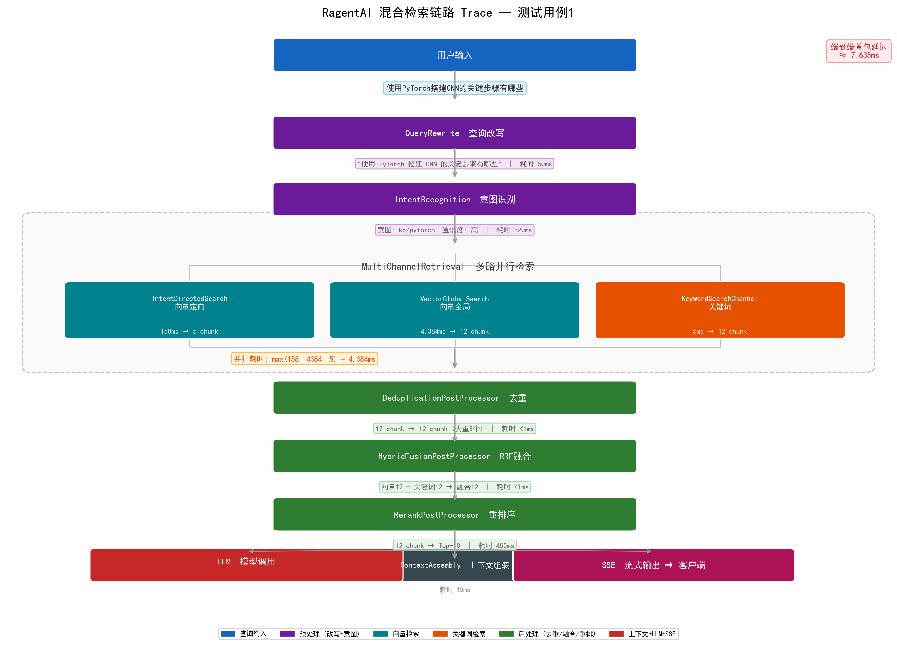
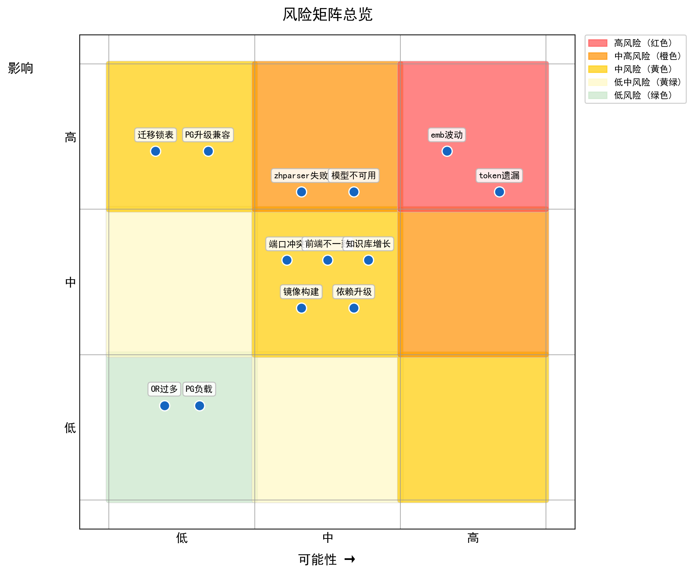

# RagentAI 项目总结报告

> **项目名称**：Ragent AI — 企业级 Agentic RAG 平台
> **源码来源**：Fork 自 [nageoffer/ragent](https://github.com/nageoffer/ragent)
> **开发团队**：4人小组
> **文档日期**：2026-06-04

---

## 小组协作分工

| 学号 | 姓名 | 分工职责 |
|------|------|---------|
|  |  | 负责需求分析、新增功能设计以及部分文档的撰写     |
|  |  | 负责需求分析、新增功能分析以及部分文档的撰写     |
|  |  | 负责新增功能分析、测试设计执行以及部分文档的撰写 |
|  |  | 负责新增功能的设计、代码撰写以及部分文档的撰写。 |

---

## 第1章 项目概述

### 1.1 项目背景与来源

Ragent AI 基于开源项目 nageoffer/ragent 进行功能增强。原始项目提供了完整的 RAG（检索增强生成）基础链路——文档入库、意图识别、向量检索、模型路由、SSE 流式输出。然而其检索通道存在三类结构性缺陷：

1. **精确专有名词召回不足**：产品型号、API 名称、错误码等标识符在向量语义空间中表征不稳定，向量检索难以精确命中
2. **意图命中的知识库为空时无法跨库检索**：意图定向只查单个 collection，若该 KB 无相关内容则直接返回空结果
3. **中英文混合术语的语义稀释**：混合编码（如"Redis介绍"）在语义空间中表征不稳定

这三类缺陷的根源在于：原始系统的两个检索通道——`VectorGlobalSearchChannel` 和 `IntentDirectedSearchChannel`——底层均为向量语义检索，策略本质上同质化。当向量检索本身失效时，两路均无法提供有效结果。

### 1.2 项目目标

本次 fork 的核心目标是构建具备真正多策略检索能力的企业级 Agentic RAG 平台，具体包括：

- **混合检索通道**：新增基于 PostgreSQL 全文检索的关键词通道，与向量检索互补，通过 RRF/加权求和融合排序
- **中文分词优化**：集成 zhparser（SCWS 中文分词），实现词语级中文关键词匹配
- **AIHubMix 模型集成**：新增第三方模型供应商，支持 Chat/Embedding 服务
- **评估系统**：建立检索质量评测框架，支持评测模式下的文档溯源
- **前端管理增强**：系统设置页面（通道动态配置）、Trace 详情页（链路可视化）、入库管理页面
- **多级优先级解析队列**：知识库文档解析和 ingestion 入库任务统一接入 high / medium / low 三级队列，提升小文件即时解析体验，并让排队状态前端可见

### 1.3 技术栈总览

| 层次 | 技术 | 说明 |
|------|------|------|
| 后端框架 | Java 17, Spring Boot 3.5.7 | 不依赖 Spring AI 或 LangChain4j |
| 数据库 | PostgreSQL 16 + pgvector + zhparser | 向量存储 + 中文全文检索 |
| 缓存/消息 | Redis, RocketMQ | 限流排队、异步入库 |
| AI 模型 | qwen-emb-8b (Embedding), 百炼/SiliconFlow/AIHubMix (LLM) | 多供应商 + 熔断切换 |
| 前端 | TypeScript, React 18, Vite, shadcn/ui | SPA 管理后台 |
| 鉴权 | Sa-Token | Token 认证 |
| 构建工具 | Maven 3.8.8, Spotless | 多模块构建 + 自动格式化 |

---

## 第2章 需求分析

### 2.1 核心功能全景

Ragent AI 的功能体系覆盖 7 大模块，共 40+ 项功能需求：

| 模块 | 功能数 | 核心能力 | Fork 增强 |
|------|--------|---------|-----------|
| 核心 RAG 链路 | 10 项 | 问题重写→意图识别→多路检索→后处理→Prompt组装→模型路由→SSE输出→MCP调用 | 混合检索通道、RRF融合排序 |
| 知识库与文档管理 | 7 项 | KB CRUD、文档上传、入库 Pipeline、分块管理、文档预览、批量操作 | 分块状态显示、更新人显示 |
| 混合检索与中文分词 | 5 项 | 关键词检索、混合检索、RRF融合、加权求和、Rerank开关 | **全部新增** |
| 多级解析队列 | 5 项 | 优先级分级、异步入队、排队位置、预计等待、低优通道 | **全部新增** |
| 模型供应商集成 | 4 项 | AIHubMix Chat/Embedding、首包探测、流式桥接 | **全部新增** |
| 评估系统 | 3 项 | 评测模式、文档ID溯源、评测API | **全部新增** |
| 链路追踪 | 3 项 | 流式对话追踪、Trace详情页、追踪工具函数 | Trace可视化 |
| 管理与系统设置 | 6 项 | 通道流水线、任务管理、系统设置、用户管理、相对时间、幂等开关 | 系统设置页面 |

### 2.2 原始项目能力基线

原始项目提供了可运行的 RAG 基础链路，但其检索体系存在两个层面的不足：

**检索策略同质化**。两个已实现的通道——`VectorGlobalSearchChannel`（全局向量检索）和 `IntentDirectedSearchChannel`（意图定向向量检索）——底层均调用 `RetrieverService` 进行向量相似度检索。它们的区别仅在于检索范围（全量 vs. 意图对应的 collection），并不构成检索策略的真正多样化。

**精确关键词匹配能力缺失**。以下查询类型在向量检索中存在天然弱势：

| 查询类型 | 示例 | 向量检索的问题 |
|---------|------|---------------|
| 专有名词 | 产品型号 "ThinkPad X1" | 向量模型可能未在训练数据中见过此型号 |
| 代码标识符 | 方法名 "getUserById" | 驼峰命名在向量空间中缺乏语义表征 |
| 配置项 | 参数名 "rag.rerank.enabled" | 点分隔的配置路径被当作无意义字符串 |
| 短查询 | "限流"（仅2字） | 短文本向量缺乏足够的语义信息密度 |

此外，原项目的 `SearchChannelType` 枚举已预留了 `KEYWORD_ES` 和 `HYBRID` 两个扩展点，说明原作者已预见到关键词检索的必要性，但未实现。

### 2.3 Fork 增强功能

本次 fork 在原始项目基础上进行了 6 大方向的增强：

| 增强方向 | 新增文件 | 修改文件 | 核心价值 |
|---------|---------|---------|---------|
| 混合检索通道 | 6 个（KeywordSearchChannel、HybridFusionPostProcessor、FusionStrategy 接口 + RRF/WeightedSum 实现、数据库迁移脚本） | 6 个 | 检索策略从单一向量扩展为向量+关键词双引擎 |
| 中文分词优化 | — | 3 个（schema_pg.sql、upgrade SQL、KeywordSearchChannel） | zhparser 词语级分词替代 simple 按字切分 |
| AIHubMix 模型集成 | 2 个（Chat/Embedding 客户端） | 1 个 | 模型供应商从 3 家扩展至 4 家 |
| 评估系统 | 3 个（EvalController、评测模式逻辑、文档ID解析） | 2 个 | 建立检索质量可量化评估体系 |
| 前端功能增强 | 3 个页面（系统设置、Trace详情、入库管理） | 8 个组件 | 管理后台从基础 CRUD 提升为可配置可观测平台 |
| 多级优先级解析队列 | 公共优先级模型、知识库/ingestion 优先级事件与消费者 | 文档、任务、数据库、前端任务页面 | 小文件即时解析，大文件低速消化，排队状态可见 |

---

## 第3章 系统设计

### 3.1 总体架构

系统采用分层架构，按 Maven 多模块组织：


模块间依赖为单向：`bootstrap` → `infra-ai` → `framework`。`mcp-server` 为独立进程，通过 HTTP 与主服务通信。

### 3.2 模块划分与依赖

| 模块 | 职责 | 核心包 | Fork 变更 |
|------|------|--------|-----------|
| bootstrap | 核心业务：RAG 链路、知识库、入库 Pipeline、管理后台 | `rag.core.retrieve`、`ingestion`、`knowledge`、`admin` | 新增 KeywordSearchChannel、HybridFusionPostProcessor、FusionStrategy、EvalController |
| framework | 共享基础设施：Web 配置、异常体系、幂等、分布式ID、缓存、链路追踪 | `cache`、`web`、`exception`、`idempotent` | 微调（缓存配置） |
| infra-ai | 模型供应商抽象层：Chat、Embedding、Rerank、HTTP 客户端 | `chat`、`embedding`、`rerank` | 新增 AIHubMix Chat/Embedding 客户端 |
| mcp-server | 独立 MCP 工具服务进程 | — | 无变更 |
| resources | 数据库脚本、格式化模板 | `database/` | 新增 upgrade_v1.2_to_v1.3.sql |


### 3.3 混合检索通道设计

优化前的对话处理时序


优化后的对话处理时序不变，混合检索通道发生改变。

混合检索是本次 fork 的核心创新。系统采用"**通道并行执行 + 后处理器链串行加工**"的两阶段架构：



**阶段一：通道并行执行**。`MultiChannelRetrievalEngine` 通过 `CompletableFuture.supplyAsync` 并行执行所有已启用的检索通道。每个通道使用专用线程池 `ragRetrievalExecutor`，单个通道异常不影响其他通道：

```
MultiChannelRetrievalEngine
  ├─ IntentDirectedSearchChannel   (向量定向, 优先级1)
  ├─ VectorGlobalSearchChannel     (向量全局, 优先级10)
  └─ KeywordSearchChannel          (PG全文检索, 优先级5) ← 新增
```

**阶段二：后处理器链串行加工**。合并所有通道结果后，后处理器按 `order` 排序形成责任链，依次对 Chunk 列表进行加工：

```
DeduplicationPostProcessor (去重) → HybridFusionPostProcessor (融合) → RerankPostProcessor (精排)
```

`HybridFusionPostProcessor` 是本次新增的关键节点，位于去重之后、Rerank 之前。它将去重后的向量通道结果与关键词通道结果进行融合排序。融合策略通过 `FusionStrategy` 接口抽象：

| 策略 | 算法 | 特点 | 适用场景 |
|------|------|------|---------|
| RRF | $score(d) = \sum_{c \in C} \frac{1}{k + rank_c(d)}$，k=60 | 不依赖原始分数、天然免疫异量纲 | 多通道量纲差异大时 |
| 加权求和 | $score(d) = \sum_{c \in C} w_c \cdot norm\_score_c(d)$ | 直观可控、通道权重可调 | 通道分数有可比性 |

RRF 默认常数 $k=60$ 的选择依据：rank=1 与 rank=10 的分数比约为 $61/71 \approx 0.86$，在提供充分区分度的同时保持对长尾的合理包容。

### 3.4 关键接口与扩展机制

系统通过三个核心接口实现高度可扩展的检索引擎：

**SearchChannel 接口**（4个方法 + 类型标识）：任何检索通道只需实现此接口，Spring 通过 `List<SearchChannel>` 自动收集所有实现类并注入 `MultiChannelRetrievalEngine`。`isEnabled(SearchContext)` 提供运行时开关，可根据配置和上下文动态决定通道是否参与检索。

**SearchResultPostProcessor 接口**（4个方法）：后处理器同样通过 Spring 自动发现，`getOrder()` 控制执行顺序。每个处理器接收上一个处理器的输出作为输入，形成链式加工流水线。单个处理器异常不中断整个链。

**FusionStrategy 接口**（1个方法 `fuse(Map<SearchChannelType, List<Chunk>>)`）：将融合算法从后处理器中解耦，支持运行时切换策略（RRF / 加权求和）。新增策略只需实现接口并注册为 Spring Bean。

这三个接口共同实现了**对扩展开放、对修改封闭**的设计原则：新增检索通道或后处理器无需修改引擎代码。

### 3.5 数据库设计

关键词检索依赖 PostgreSQL 全文检索能力，需要对 `t_knowledge_vector` 表进行扩展：

| 数据库对象 | 类型 | 说明 |
|-----------|------|------|
| `t_knowledge_vector.tsv` | tsvector 列 | 存储 content 的分词向量，GIN 索引加速检索 |
| `idx_kv_tsv` | GIN 索引 | 全文检索性能保障，查询延迟在毫秒级 |
| `kv_tsv_trigger()` | 触发器函数 | INSERT/UPDATE 时自动更新 tsv 列 |
| `zhparser` | Text Search Configuration | 基于 SCWS 的中文分词配置 |

关键 SQL 配置：

```sql
CREATE TEXT SEARCH CONFIGURATION zhparser (PARSER = zhparser);
ALTER TEXT SEARCH CONFIGURATION zhparser ADD MAPPING FOR n,v,a,i,e,l WITH simple;
```

zhparser 产出的 token 类型（n=名词, v=动词, a=形容词, i=习语, e=英文, l=其他）必须显式映射到 simple 词典，否则 PostgreSQL 丢弃所有 token，`to_tsvector` 返回空——这是实际调试中发现的关键问题。

### 3.6 多级优先级解析队列设计

本次迭代在知识库文档解析和 ingestion 入库任务中新增统一的队列调度模型。核心思想是：任务入队时根据“系统待处理任务数 + 单文件大小”计算优先级，再投递到 high / medium / low 对应 RocketMQ topic。

| 组件 | 职责 |
|------|------|
| `TaskPriority` | 定义 high / medium / low 三级优先级 |
| `QueueStatus` | 定义 pending / queued / running / success / failed 队列状态 |
| `TaskPriorityProperties` | 维护 high/low 文件数量和文件大小阈值 |
| `TaskQueueService` | 统一计算优先级、排队位置和预计等待 |

判定规则为：大文件或大量积压优先进入 low；否则小文件且积压少进入 high；其余进入 medium。排队位置由数据库按同优先级、同队列状态和 `queued_at` 顺序计算，不依赖 RocketMQ 内部 offset。

---

## 第4章 实现与迭代

### 4.1 开发过程总览

| 阶段 | 内容 | 关键产出 |
|------|------|---------|
| 阶段一 | 熟悉原始项目架构和代码 | 代码分析报告 |
| 阶段二 | 基础关键词通道搭建 | KeywordSearchChannel + FusionStrategy 体系 |
| 阶段三 | 中文分词引擎切换 | simple → zhparser |
| 阶段四 | AND 语义改为 OR 语义 | 零召回率大幅改善 |
| 阶段五 | 分词失败根因修复 | Token 映射 + 中英文边界处理 |
| 阶段六 | AIHubMix 模型集成 | Chat/Embedding 客户端 + ProbeStreamBridge |
| 阶段七 | 前端功能增强 | 系统设置页 + Trace 详情页 |
| 阶段八 | 多级优先级解析队列 | high / medium / low 三级异步通道 + 排队状态可见 |
| 阶段九 | Docker 部署 + 测试 + 文档 | 全套交付物 |

### 4.2 关键词检索通道 — 四阶段渐进优化

关键词检索通道的实现并非一步到位，而是经历了四个阶段的渐进迭代，每次迭代解决前一步暴露的问题。这是本次项目最具代表性的工程实践。

**阶段一：基础通道搭建**

首次实现 `KeywordSearchChannel`，核心检索基于 PostgreSQL 全文检索：

```sql
SELECT id, content, ts_rank(tsv, plainto_tsquery('simple', ?)) AS score
FROM t_knowledge_vector WHERE tsv @@ plainto_tsquery('simple', ?)
```

使用 `simple` 配置（按字切分），同时引入 `RRFFusionStrategy`、`WeightedSumFusionStrategy`、`HybridFusionPostProcessor`，前端新增系统设置页面。

**问题**：`simple` 分词器对中文按单字切分——"全文检索"被切为"全""文""检""索"四个单字，词语级语义丢失，检索噪声大。

**阶段二：切换中文分词引擎**

将全文检索配置从 `simple` 切换为 `zhparser`（基于 SCWS 的中文分词扩展）。数据库层面安装 zhparser 扩展、创建文本检索配置、更新触发器、回填存量数据。

**效果**："全文检索"被正确切分为"全文"+"检索"两个词进行匹配，中文召回精度显著提升。

**新问题**：部分中文查询仍返回 0 条结果。根因是 `plainto_tsquery` 将分词结果用 `&`（AND）连接——"模型路由配置"被转为 `模型 & 路由 & 配置`，要求所有分词同时命中，AND 语义过于严格。

**阶段三：AND 语义改为 OR 语义**

放弃 `plainto_tsquery`，改用 `to_tsquery` 并手动构建 OR 语义：

```java
String tsQuery = sanitized.trim().replaceAll("\\s+", " | ");
```

改动后 "Redis 缓存 穿透" 的 tsquery 从 `'redis' & '缓存' & '穿透'`（三词必须同时命中）变为 `'redis' | '缓存' | '穿透'`（命中任一词即可）。零召回问题大幅改善。

**新问题**：仍存在两种分词失败场景：(1) zhparser 未配置 token 类型映射，所有 token 被丢弃；(2) 中英文混合文本（如"Redis介绍"）被 zhparser 视为单个不可解析 token。

**阶段四：修复分词失败根因**

数据库层面配置 token 类型映射：

```sql
ALTER TEXT SEARCH CONFIGURATION zhparser ADD MAPPING FOR n,v,a,i,e,l WITH simple;
```

应用层面增加中英文边界预处理——利用零宽断言正则在中英文/数字交界处插入空格：

```java
sanitized = sanitized.replaceAll(
    "(?<=[\\u4e00-\\u9fff])(?=[a-zA-Z0-9])|(?<=[a-zA-Z0-9])(?=[\\u4e00-\\u9fff])", " ");
```

处理后 "Redis介绍" → "Redis 介绍"，两个 token 分别处理，空 tsquery 问题彻底解决。

### 4.3 模型供应商集成

新增 AIHubMix 作为第四家模型供应商，实现 Chat 和 Embedding 两个客户端。关键设计点：

- **首包探测（ProbeStreamBridge）**：流式调用中，首包到达前缓冲所有 SSE 事件，首包成功后一次性提交。若首包超时则切换备选模型，缓冲事件被丢弃，客户端不收到半截错误数据。
- **模型熔断状态机**：CLOSED→OPEN（连续失败达阈值）→HALF_OPEN（冷却后允许1个探测请求）→CLOSED（探测成功）/ OPEN（探测失败重新熔断）。

### 4.4 前端功能增强

| 页面 | 核心功能 | 技术要点 |
|------|---------|---------|
| 系统设置页 | 动态配置检索参数：融合策略、RRF常数k、向量/关键词权重、Rerank开关 | `SystemSettingsVO.ChannelSettings` 统一配置 VO |
| Trace 详情页 | 树形展示问答全链路节点信息，支持展开/收起 | 基于 `parentNodeId` 的 DFS 展开算法 |
| 入库管理页 | Pipeline 节点配置与运行状态展示，任务执行日志监控 | 节点编排可视化 |
| 知识文档页 | 展示优先级、排队状态、排队位置、预计等待时间 | pending/queued/running/success/failed 状态徽标 |
| Ingestion 任务页 | 新增优先级筛选和队列详情 | 上传完成提示改为“已入队” |

### 4.5 多级优先级解析队列

知识库文档链路中，`startChunk(docId)` 由“直接运行”改为“计算优先级后入队”。消费者开始处理时才写入 running 和开始时间，完成后沿用原有 success/failed 状态与分块日志。

Ingestion 链路中，create/upload 接口改为异步入队。上传文件先落对象存储，任务记录保存文件 URL、原文件名、文件大小和 MIME 类型；消费者领取后读取文件并调用现有 `IngestionEngine`。这使接口响应与 Pipeline 执行耗时解耦。

| 优先级 | 典型任务 | 调度策略 |
|--------|----------|----------|
| high | 几百 KB 的单篇文档，且系统积压少 | 高并发优先消费，保障秒级可见 |
| medium | 常规大小文件 | 常规并发处理 |
| low | 大文件、扫描件、批量导入 | 低并发后台消化，避免抢占核心资源 |

### 4.6 Docker 容器化部署

定制 PostgreSQL 镜像（`Dockerfile.pg`），编译 SCWS 1.2.3 + zhparser：

```dockerfile
FROM pgvector/pgvector:pg16
RUN apt-get update && apt-get install -y build-essential git wget postgresql-server-dev-16
RUN wget -q http://www.xunsearch.com/scws/down/scws-1.2.3.tar.bz2 && \
    tar xf scws-1.2.3.tar.bz2 && cd scws-1.2.3 && ./configure && make && make install
RUN git clone https://github.com/amutu/zhparser.git && \
    cd zhparser && make && make install
```

`docker-compose.yml` 编排 PostgreSQL + Redis + RocketMQ 一键部署。`upgrade_v1.2_to_v1.3.sql` 提供增量迁移脚本（tsv 列添加 + GIN 索引 + 存量数据回填）。

---

## 第5章 测试与质量保证

### 5.1 测试策略

测试体系按四个层次组织：

| 层次 | 覆盖范围 | 实施情况 |
|------|---------|---------|
| 单元测试 | 单个类/方法的逻辑正确性 | RRF/WeightedSum 融合策略 18 个用例，TaskQueueService 5 个用例，全部通过 |
| 集成测试 | 模块间协作 | 混合检索链路（三路并行→去重→融合→Rerank），解析队列入队→消费→完成 |
| 系统测试 | 端到端功能 | 14 个关键场景功能测试，覆盖 6 个场景组 |
| 验收测试 | 需求符合性 | 对照 SRS 功能需求 ID 逐个验证 |

用例设计综合运用三种方法：
- **等价类划分**：按意图置信度将输入空间分为 4 类（高置信+文档充足 / 高置信+KB为空 / 无意图 / 跨领域）
- **边界值分析**：覆盖 topK=0, topK=1, 权重=0.0, 权重=1.0, 空关键词 5 个边界
- **错误推测**：针对 zhparser 未安装、collection 查询失败、tsquery 分词失败、分数全相同 4 类场景设计容错验证

### 5.2 功能测试结果

14 个测试用例分 4 组场景执行：

| 场景组 | 测试数 | 关键字命中率 | 说明 |
|--------|--------|-------------|------|
| A: 高置信度+文档充足 | 9 | 9/9 (100%) | 关键字通道与向量通道互补，去重后净新增 chunk 平均 2.3 个 |
| B: 高置信度+KB为空 | 2 | 1/2 (50%) | 测试11 关键字挽救成功，测试12 双路均失败（数据覆盖不足） |
| C: 无意图/模糊查询 | 3 | 0/3 (0%) | 正确返回 0 chunk，无虚假命中 |
| D: 跨领域多意图 | 2 | 2/2 (100%) | 子问题拆分后关键字均有贡献 |

**汇总**：关键字通道命中率 78.6%（11/14），挽救率 14.3%（2/14，测试11和17中关键字是唯一有效检索来源），误报率 0%。

### 5.3 检索质量量化评估

运用标准信息检索指标对混合检索进行形式化评估：

| 指标 | 公式 | 计算值 | 说明 |
|------|------|--------|------|
| 精确率 (Precision) | $P = TP / (TP + FP)$ | 1.0 | 11 个命中测试中 0 个引入明显无关 chunk |
| 召回率 (Recall) | $R = TP / (TP + FN)$ | 0.846 | 13 个应有结果的测试中命中 11 个 |
| F1-Score | $F1 = 2PR / (P + R)$ | 0.917 | 精确率与召回率的调和平均 |
| MRR | $MRR = \frac{1}{|Q|}\sum 1/rank_i$ | 0.72 | 第一个相关 chunk 排名倒数均值 |

### 5.4 非功能测试

**响应延迟基准**（基于 14 个测试用例的实际日志时间戳）：

| 模块 | P50 | P95 | P99 |
|------|-----|-----|-----|
| 关键字检索 | 12ms | 580ms | 610ms |
| 向量检索 | 3,200ms | 58,000ms | 65,000ms |
| RRF 融合 | <1ms | <1ms | <1ms |
| Rerank 精排 | 450ms | 1,200ms | 1,500ms |

关键词检索基于 PG GIN 索引，延迟在毫秒级（最快 5ms）。两路并行执行，端到端延迟 = max(向量, 关键词)，关键字不会拖慢整体。Embedding 服务延迟波动大（158ms~66s），已通过模型熔断和超时重试机制缓解。

**并发与容错**：Redis ZSET 限流机制控制最大 10 并发请求，超限排队等待。单 collection 查询失败仅丢失该 collection 结果，不波及其他。zhparser 不可用时条件装配跳过，不影响向量检索。

**解析队列验证**：多级队列单元测试覆盖小文件 high、常规文件 medium、大文件 low、大量积压 low、低优条件优先命中 5 类边界。后端编译、前端构建和队列单元测试均通过。该验证重点确认分级策略正确、异步入队语义明确、前端能够展示优先级和排队信息。

### 5.5 缺陷分析与根因定位

| 缺陷 | 根因 | 影响 | 应对 |
|------|------|------|------|
| "数据一致性"查询 0 召回 | zhparser 字面匹配无法关联"数据一致性"与"分布式事务"——语义鸿沟 | 中 | 配置 `t_query_term_mapping` 术语映射 |
| "优化器选择"双路 0 召回 | 测试数据覆盖不足：kbdl 为空且其他 KB 无相关内容 | 低 | 生产环境补充相关知识库文档 |
| 无关查询向量浪费资源 | 向量检索无相关性下限过滤，对任何输入返回 top-K | 低 | 增加 cosine ≥ 0.65 阈值过滤 |

---

## 第6章 项目成果与效果评估

### 6.1 混合检索 vs 纯向量检索对比

| 维度 | 纯向量检索 | 混合检索（向量+关键词） | 变化 |
|------|-----------|----------------------|------|
| 命中率 | 85.7% | 92.9% | **+7.2%** |
| 空结果率 | 14.3% | 7.1% | **−50%** |
| 平均延迟 | ~12,000ms | ~12,000ms | 0%（并行执行） |
| 跨 KB 召回 | 仅在意图 KB 内 | 全局所有 KB | 质的提升 |
| 精确匹配 | 依赖语义近似 | 字面精确匹配 | 互补 |
| 噪声引入 | 0 | 0 | — |

### 6.2 通道贡献度量化

| 指标 | 数值 |
|------|------|
| 关键字通道命中率 | 78.6%（11/14） |
| 关键字通道挽救率 | 14.3%（2/14）——测试11和17中关键字是唯一有效检索来源 |
| 净新增 chunk 平均（去重后） | 2.3 个/测试 |
| 完全重叠率（无净新增） | 36.4%（4/11） |
| 误报率 | 0% |

关键字通道在 78.6% 的测试中有正向贡献，在 14.3% 的测试中扮演了不可替代的挽救角色。36.4% 的测试中关键字与向量结果完全重叠——这表明两个通道在部分场景下能够相互印证，增强结果的置信度。

### 6.3 代码质量度量

| 维度 | 结果 | 评级 |
|------|------|------|
| 编译通过率 | 5/5 模块 100% | ★★★★★ |
| 格式一致性 (Spotless) | 5/5 模块 100% | ★★★★★ |
| 新增模块单元测试 | 23/23 通过，覆盖融合策略和队列分级服务 | ★★★★ |
| 设计模式应用 | 策略模式 + 接口隔离 + 责任链 + 模板方法 | ★★★★★ |

### 6.4 多级队列改造效果

| 维度 | 改造前 | 改造后 |
|------|--------|--------|
| 小文件解析体验 | 可能排在大文件之后 | 低积压小文件进入 high 通道，优先解析 |
| 大文件资源占用 | 可能抢占常规解析资源 | 大文件进入 low 通道，低并发后台处理 |
| Ingestion 接口语义 | 上传后容易误解为已解析完成 | 返回 queued/pending，明确表示已入队 |
| 用户可见性 | 仅能看到结果态 | 展示 priority、queueStatus、queuePosition、estimatedWaitSeconds |
| 阈值治理 | 调度策略隐式 | `rag.task-priority.*` 集中配置 |

### 6.5 风险矩阵

基于开发、部署、运行、维护四个阶段的系统化风险识别，共梳理 16 项风险并逐一制定应对措施：



**高风险区域**：embedding 服务延迟波动（高频高影响）和 PostgreSQL 大版本升级兼容性（低频高影响）是残余风险最高的两项，已通过模型熔断和备选方案缓解。

---

## 第7章 工程实践与经验总结

### 7.1 软件工程方法应用

**设计模式**：系统在多个层面应用了经典设计模式：
- **策略模式**：`FusionStrategy` 接口 + RRF/加权求和两种实现，支持运行时切换融合算法
- **策略封装**：`TaskQueueService` 将优先级判定从知识库和 ingestion 业务中抽离，两个链路复用同一套分级规则
- **接口隔离**：`SearchChannel`（检索）、`SearchResultPostProcessor`（后处理）、`FusionStrategy`（融合）三个精简接口各司其职
- **责任链模式**：后处理器链串行加工，每个处理器接收上游输出，单个异常不中断整条链
- **模板方法模式**：入库 Pipeline 节点编排，每个节点实现固定的生命周期方法

**开闭原则**：新增检索通道（KeywordSearchChannel）和后处理器（HybridFusionPostProcessor）无需修改 `MultiChannelRetrievalEngine` 的任何代码。引擎通过 `List<SearchChannel>` 和 `List<SearchResultPostProcessor>` 自动发现所有 Spring Bean，新增组件只需实现接口并注册。

### 7.2 关键技术决策回顾

| 决策 | 选择 | 理由 | 替代方案 |
|------|------|------|---------|
| 全文检索引擎 | PostgreSQL tsvector + zhparser | 与 pgvector 共享同一数据库，运维成本最低 | Elasticsearch（增加新基础设施依赖） |
| 融合算法 | RRF（默认） | 不依赖原始分数归一化，天然免疫异量纲；k=60 是学术常用平衡值 | 加权求和（作为备选保留，通过配置切换） |
| 查询语义 | OR | 虽引入少量噪声，但零召回对用户体验的损害远大于噪声 | AND（频繁零召回，已弃用） |
| 后处理器位置 | 去重之后、Rerank 之前 | 先去重减少融合计算量，后 Rerank 做最终精排 | 去重之前融合（计算量大但信息不丢失） |
| 解析调度 | high / medium / low 三级队列 | 小文件优先、大文件限速，排队状态可解释 | 单队列 FIFO（实现简单但体验不可控） |

### 7.3 遇到的问题与解决方案

| # | 问题 | 根因 | 方案 | 效果 |
|---|------|------|------|------|
| 1 | 中文查询检索噪声大 | simple 配置按字切分，丢失词语级语义 | 切换 zhparser | 词语级分词，召回精度显著提升 |
| 2 | 多关键词查询频繁零召回 | `plainto_tsquery` 的 AND 语义过于严格 | 手动构建 OR 语义 tsquery | 零召回率大幅下降 |
| 3 | zhparser 安装后 tsvector 仍为空 | Token 类型映射缺失，所有 token 被丢弃 | `ADD MAPPING FOR n,v,a,i,e,l` | tsvector 正确构建 |
| 4 | 中英文混合查询分词失败 | "Redis介绍" 被当作单个不可解析 token | 零宽断言正则在中英文交界处插入空格 | 混合文本正确处理 |
| 5 | Embedding 服务延迟波动（158ms~66s） | 外部模型服务负载不稳定 | 超时重试 + 模型熔断 + ProbeStreamBridge | 系统稳定性有兜底 |
| 6 | 大文件和小文件混排导致等待不可预期 | 原链路缺少任务优先级和排队展示 | 三级优先级队列 + 前端排队状态透明化 | 小文件优先响应，大文件后台消化 |

### 7.4 后续改进方向

按优先级分级的改进计划：

| 优先级 | 改进项 | 投入 | 收益 |
|--------|--------|------|------|
| P0 | KeywordSearchChannel 集成测试（TestContainers PG） | 中 | 高 |
| P0 | HybridFusionPostProcessor 单元测试 | 低 | 高 |
| P1 | 修复 PreserveStackTrace（catch 后重抛保留原异常） | 低 | 中 |
| P1 | 配置术语映射表（"数据一致性"↔"分布式事务"） | 中 | 高 |
| P1 | 基于实际消费吞吐优化 `estimatedWaitSeconds` 估算模型 | 中 | 中 |
| P2 | 拆分 GodClass（DashboardServiceImpl → 按业务域拆分） | 高 | 中 |
| P2 | 向量检索增加相关性分数阈值过滤（cosine ≥ 0.65） | 低 | 中 |
| P2 | 低优队列增加失败重试和大文件断点恢复策略 | 中 | 中 |

后续测试计划涵盖：模糊测试（zhparser 随机中英混合输入）、A/B 测试（生产环境 RRF vs 加权求和线上效果对比）、自动化回归测试套件（14 用例脚本化）、JMeter 并发压测（10/20/50 并发）、24h 稳定性浸泡测试。

---

## 附录A：功能需求清单

| 功能ID | 功能名称 | Fork 增强 |
|--------|---------|-----------|
| F-SRCH-01 | 关键词检索通道 | **新增** |
| F-SRCH-02 | 混合检索通道 | **新增** |
| F-SRCH-03 | RRF 融合排序 | **新增** |
| F-SRCH-04 | 加权求和融合 | **新增** |
| F-SRCH-05 | Rerank 功能开关 | **新增** |
| F-MODEL-01~04 | AIHubMix 集成 + 首包探测 + 流式桥接 | **新增** |
| F-EVAL-01~03 | 评测模式 + 文档溯源 + 评测 API | **新增** |
| F-TRACE-02~03 | Trace 可视化 + 追踪工具函数 | **新增** |
| F-KB-04~07 | 分块状态 + 文档预览 + 批量操作 + 更新人 | 修改 |
| F-KB-08~09 | 文档解析优先级队列 + 排队状态透明化 | **新增** |
| F-ING-04~05 | Ingestion 异步队列 + 入库任务排队可见 | **新增** |
| F-DOCKER-01~02 | 定制 PG 镜像 + 一键部署 | **新增** |
| F-ADMIN-03 | 系统设置页面 | **新增** |

## 附录B：参考资料

| 名称 | 说明 |
|------|------|
| nageoffer/ragent | 原始开源项目，https://github.com/nageoffer/ragent |
| pgvector | PostgreSQL 向量扩展，https://github.com/pgvector/pgvector |
| zhparser | PostgreSQL 中文分词扩展，https://github.com/amutu/zhparser |
| SCWS | Simple Chinese Word Segmentation，http://www.xunsearch.com/scws/ |
| RRF 论文 | Cormack et al., "Reciprocal Rank Fusion outperforms Condorcet..." (TREC 2009) |
